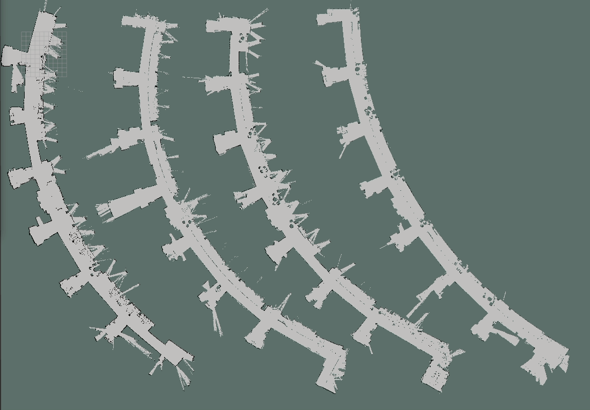

# Robot Localization
## Project Overview
The primary goal of this project was to implement a particle filter algorithm in order to localize a robot within a given map. At a base level, the initial position of the robot is known and the particle filter is used to track its motion over time. Taking it one step further, the initial position of the robot is not given. This is known as the kidnapped robot problem, which was the primary target of this project to solve on large-scale maps.

In order to accomplish these tasks, we needed to integrate a variety of data from the TurtleBot4. This data primarily consisted of the laser scan data and the odometry of the robot. The full implementation, described below, can be found in this [github repository](https://github.com/ayushchakra/robot_localization).

Note: Parts of the initial implementation for this project were provided as starter code. This consists of large parts of the ROS Node workflow, the original occupancy field implementation, and the helper functions. This was to help guide the project's focus towards implementing and debugging the particle filter at a conceptual level, rather than spending extensive time on accessories to the workflow.

## Problem-Solving Approach
In order to solve our end goal of the kidnapped robot problem, we chose to implement an iterative approach that started with solving the MVP particle filter problem and slowly incremented until it was able to be tested on the map of the full MAC with no initial position given. 

### MVP Particle Filter
The MVP for the particle filter was to use a particle cloud to track the position of a robot when given its starting position. This form of tracking the robot's position helps reduce the impact of odometry drift while tracking the position of the robot over time. An example implementation of this section is shown below:

### Optimizing Code
Once the MVP particle filter was consistently working, we decided to optimize our code in order to improve its overall runtime. This was motivated by us realizing that we would need to drastically scale up the number of particles used when trying to solve the kidnapped robot problem and that inefficient code would hinder the particle filter's ability to converge on the actual position of the robot. To do this, we converted the majority of our for loops into matrix operations. This is because python's numpy library is very effecient at handling matrix operations as compared to the inefficiencies of an iterative for loop in python. 

### Kidnapped Robot Problem
Once the code had been sufficiently optimized, we shifted our focus to tackle the kidnapped robot problem. The primary change that this entailed was removing code for extracting the initial position of the robot. To compenstate for this loss of data, we drastically increased the number of particles being generated to form the particle cloud and employed a more sophisticated particle cloud intialization strategy (explained in more detail below). Along with careful tuning of odometry variance, we were able to relatively consistently localize the robot within a map of half of a floor of Olin's MAC.

## Particle Filter Workflow
The main workflow of the particle filter is defined in the `run_loop` function of the `ParticleFilter` Node. The main operations executed by `run_loop` are as following:
1. Initialize particle cloud
    - Creates a list of `n_particles` that represents potential "global" coordinates for the actual robot.
2. Process the current scan
    - Converts the current laser scan data from the LiDAR reference frame to the odometry reference frame.
3. Check if the robot has moved past a certain threshold to trigger a particle update
    - Since particle updates are computationally intensive, they can not be continuously called, which is why the robot must move and/or turn by a certain amount to trigger an update.
4. If it has, update each particle's position based on the odometry change.
    - Move each particle by the change in odometry as if it was the actual robot, yielding its updated position.
5. Update the weight of the particle based on the simulated laser scan.
    - Project the obtained laser scan onto each particle and compute how likely the particle is to be the actual pose of the robot based on how well its projected scan correlates to the features of the map.
6. Resample particles
    - Resample particles in favor of more-likely particles to remove unlikely particles and add noise. This makes it more likely that the actual position of the robot will be captured by a particle.
7. Repeat steps 2-6
    - Repeat each step until the robot has completed its path.

## Design Decisions
While iterating upon our particle filter, we made several key design decision that helped guide our development process. The primary decisions we made reolved around the particle cloud initialization, the laser scan likelihood function, and odometry-based particle elimination. 

### Particle Cloud Initialization
For the particle cloud intialization, we initially started by randomly generating particles within the bounding box of the map. However, this proved to be rather inefficient as many of the initialized particles, especially when running on maps of the MAC, started outside of the MAC. This is inaccurate to the actual situation as it is known that the robot starts inside the MAC. To fix this issue, we revised the occupancy field so that points outside of the scanned region of the map did not have defined closest distances to other obstacles. Then, when initializing particles, only particles that had defined closest distances were added to the particle cloud. This drastically improved the accuracy of the particle filter in the earlier iterations and reduced the number of particles needed to confidently converge on the actual position of the robot.

### Laser Scan Likelihood Function
The laser scan likelihood function was used to convert the projected laser scan for each particle into a probabiltiy that it accurately reflects the actual position of the robot. To do this, we started by projecting the actual robot's laser scan onto each particle. Then, for each point in the projected laser scan, we found the closest distance to an obstacle in the map. For a perfect particle, this distance should be zero. The closest distances for the entire laser scan is then summed to determine the overall error of the given particle. Then, to convert this error into a likelihood, we used the transfer equation: $$ p(x) = {1 \over (E(x))^2} $$
Intuitively, this means that a very high closest distance sum leads to a very low probabiltiy and a low closest distance sum leads to a high probability.

### Odometry-Based Particle Elimination
Something else we chose to do was eliminate particles after updating their position based on the odometry movement. Any particles that moved off the map due to the odometry update were removed. This is because a particle that accurately reflected the position of the robot would not move off the map at any point during the trial. This choice served the benefit of reducing our runtime during the updating particles based on the laser scan as that process now needed to operate on less particles, which would be wasted if conducted on particles outside of the map.

## Results
Towards our goal of solving the kidnapped robot problem, we were successful in convering to the actual robot's position in the gauntlet world and the first floor of the MAC, but did not fully converge on the full MAC. 

### Gauntlet World

This gif shows the results of running a particle filter on the gauntlet world. It very quickly is able to converge to the robot's actual location because of the very distinct features in the map.

### First Floor MAC

This gif shows the results of running a particle filter on a map of the first floor of the MAC. It takes a significant amount of time and filtering out other particles, but it is able to converge onto the final position of the robot by the end of the bag file.

### Full MAC

This gif shows the results of running a particle filter on a map of the full MAC (all four floors side-by-side). Towards the end of the given bag file the best particle oscilates between the actual position of the robot and an incorrect position, however, it is not able to fully converge on the actual position.

## Reflection
### Challenges
While developing this particle filter architecture, there were many encountered challenges. The largest challenge in the design process was being able to properly update each particle's position based on the odometry update. We originally thought that this could simply be done by moving the particle in the same direction as the detected change in odometry. However, intuitively, this is incorrect as driving forward on the actual robot does not necessarily correlate to the same positional (x,y) change in the particle. Instead, we needed to figure out a way to simulate the particle "driving forward" and similar architecture for other detected odometry movements. After writing through the transformations on white boards and attending office hours, we were finally able to determine the optimal transform to shift each particle.

### Lessons Learned
Through this entire project, there were several key lessons learned that we took. The primary lessons are:
1. The MAC has a lot of non-unique features. While running the particle filter on maps of the MAC, we found that the particles would cluster into several different regions. This was because the MAC has several similar structures along the same floor and across floors. This makes it very difficult to implement a particle filter, which relies on unique features to converge on the robot's actual position.
2. Optimizing code through matrices is very useful! One of our initial bottlenecks was the runtime of the `update_particles_with_laser()` function. We were able to optimize this by converting several for loops into matrix operations, which drastically reduced our runtime and led to better results.
3. More particles doesn't always leads to better results. While testing on the full MAC, we thought that simply adding more particles would solve our issue of not converging. However, this just led to bigger clusters of particles without any increase in accuracy.

## Next Steps
The next step for this project is to iterate on the current design to develop an algorithm that is consistently able to converge to the robot's location in the map of the full MAC. There are three proposed methods for accomplishing this task, which are listed below:
1. Record longer bag files. As seen by the gif, the particle filter is very close to converging on the position of the robot. If the bag file used to launch that test was longer (contained more data), it is possible that those extra steps would help filter out the remaining cluster of bad particles, allowing the algorithm to properly converge onto the robot's position.
2. Implement a different likelihood function taht is better tuned to detecting the subtle nuanced differences within the MAC. Our current likelihood function fails to accurately capture the slightly distinct features in the MAC, which leads to large clusters of potential locations. By changing the likelihood function, it is possible that we could better tune the system to quickly rule out bad clusters of particles.
3. The last proposed solution is to switch to a different localization strategy, like a Kalman Filter. The hypothesis is that the Kalman Filter would be able to better capture the multitude of measurements captured during runtime, leading to better and more consistent convergence.